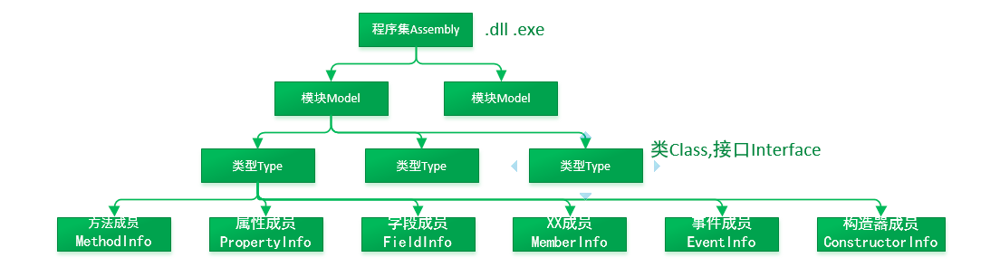

# 编译

## 程序集
```
c# -> DLL(DynamicLinkLibrary)/EXE(Executable file) (Metadata + IL(Intermediate Language)) -> CLR(Common Language Runtime) -> JIT(Just-In-Time) -> 机器码 
```


## 工具
- 查看dll 工具： ILSpy

## 内存管理

- 栈也叫线程栈
- CLR 堆的内存是连续分配的, 节约空间，如果字符串变长度，会导致大量连续移动，所以字符串设计为不可变并具备享元
- gc 是发生在 new， 当一级进入临界值会触发, 析构函数会单独处理放入一个队列但不知道什么时候调用，一般用于处理非托管内存（不在程序堆里的）
  - gc.Collect() 主动 gc
  - gc.SuppressFinalize(this) // 通知垃圾回收器不在主动调用析构器
- 字符串是引用类型
```csharp
string str = "abc";
string str2 = str; // 拷贝引用
string str3 = "abc2"
object.ReferenceEquals(str, str3) // 享元，为true，因为 CLR 内存查找会查找相同值, 所以字符串是不可变

```
- 装箱拆箱: 指内存的拷贝动作，内存堆栈来回传递，通常因为 object 
```csharp
int i = 3;
object oValue = i;
i = (int)oValue;
```
## gc优化

- 分级策略
- 
1. 首次 GC 前 全部对象都是 0级 (未经过垃圾回收的都是0级)
2. 第一次 GC 后还保留的对象为 1级
3. 回收先找0级对象，如果不够再找1级，这时候还剩下的变成 2级
4. 越是最近分配越是会被回收

- 大对象策略: 如果大于某个对象的单独管理，用的链标形式（会有碎片）

## MSIL

- https://www.gxlsystem.com/diannaowenti-383740.html
- https://zhuanlan.zhihu.com/p/20525151